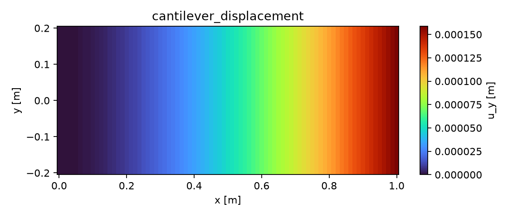
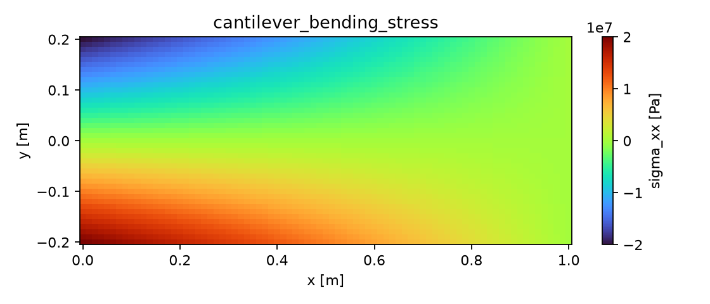

# 悬臂梁端部集中力标模（Euler–Bernoulli）

> TensorFEM public benchmark：cantilever beam tip load

**摘要** — 本案例验证梁/壳后处理链的位移、弯曲应力和反力矩。长度 `L=1 m`、等效惯性矩 `I=1e-6 m⁴`、`E=210 GPa`，自由端施加 `P=100 N`。闭式解为 `u_tip=PL³/(3EI)=1.5873016e-4 m`、`M_root=PL=100 N·m`。报告目标是 FE 结果在至少两个网格上相对参考值小于 3%，并给出位移/应力云图和收敛表。

## 1. 问题与理论模型

梁在 `x=0` 固支、`x=L` 自由。Euler–Bernoulli 小挠度模型的场解为：

```text
u_y(x) = P x² (3L-x) / (6EI)
σ_xx(x,y) = -P (L-x) y / I
M(0) = P L
```

## 2. 计算条件

| 参数 | 数值 |
|---|---:|
| 长度 `L` | 1 m |
| `E` | 210 GPa |
| 惯性矩 `I` | 1e-6 m⁴ |
| 端部载荷 `P` | 100 N |
| 单位制 | SI |
| 验收门槛 | 相对误差 `< 3%` |

## 3. 运行方法

生成参考报告：

```bash
PYTHONPATH=src .venv/bin/python \
scripts/run_standard_benchmark_report.py \
--output results/standard-benchmarks.json
```

接入有限元结果时，`--fe-results` 中至少提供 `value`、`displacement_field`、`stress_field`、`mesh_convergence` 和 `reaction`：

```bash
PYTHONPATH=src .venv/bin/python \
scripts/render_benchmark_report.py results/standard-benchmarks.json \
--output-dir results/cantilever-beam-report
```

## 4. 参考结果与场云图

| 量 | 参考值 |
|---|---:|
| 端部位移 `u_tip` | `1.5873016e-4 m` |
| 根部弯矩 | `100 N·m` |
| 最大弯曲应力（`y=0.1 m`, `x=0`） | `-10 MPa` |

解析参考场：





这些图是独立参考场，不替代 FE 云图。FE 报告必须另外给出节点/积分点云图，并在收敛表中列出：

| 网格 | FE 端部位移 | 相对误差 | 状态 |
|---:|---:|---:|---|
| coarse | 待填 | 待计算 | `blocked` 直到场数据齐全 |
| refined | 待填 | 待计算 | `blocked` 直到误差 `<3%` |

## 5. 误差与验收

```text
relative_error = abs(FE - reference) / abs(reference)
```

缺少应力场、位移场、反力或网格收敛数据时，报告状态必须为 `reference-only`；误差大于等于 3% 时必须为 `blocked`，不得标记为 `qualified`。

## 6. 结论

本案例提供可复现的闭式理论基线、场变量和报告入口。只有将真实 TensorFEM FE 结果接入并完成多网格误差验证后，才能作为软件能力认证结果发布。
