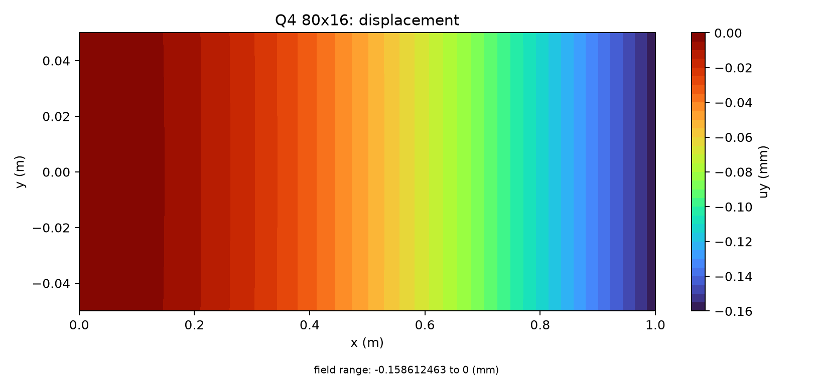
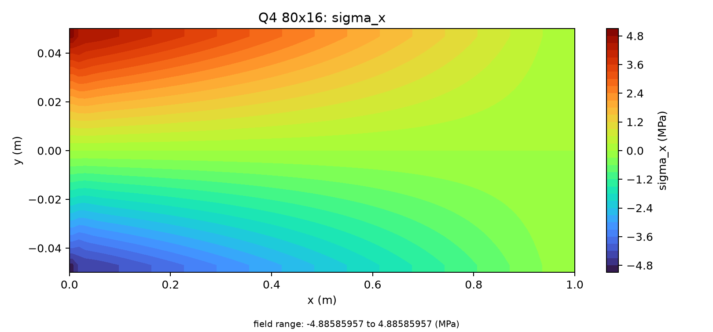
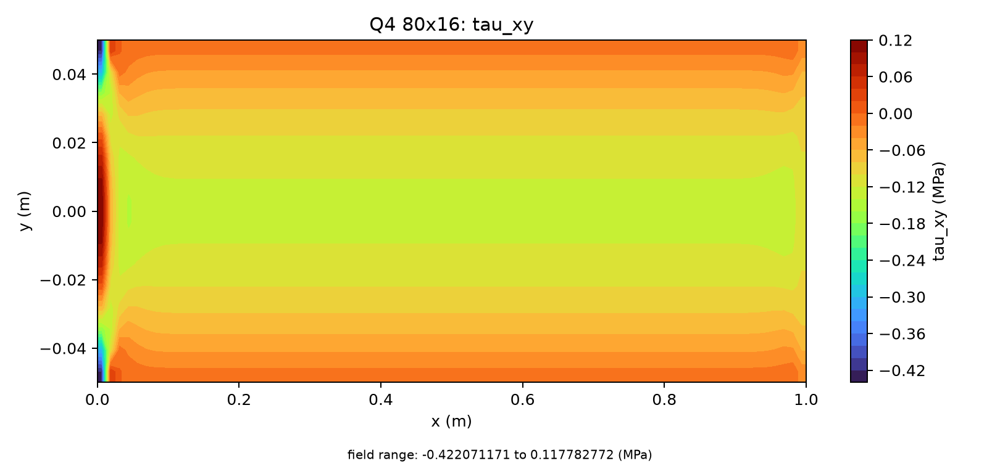
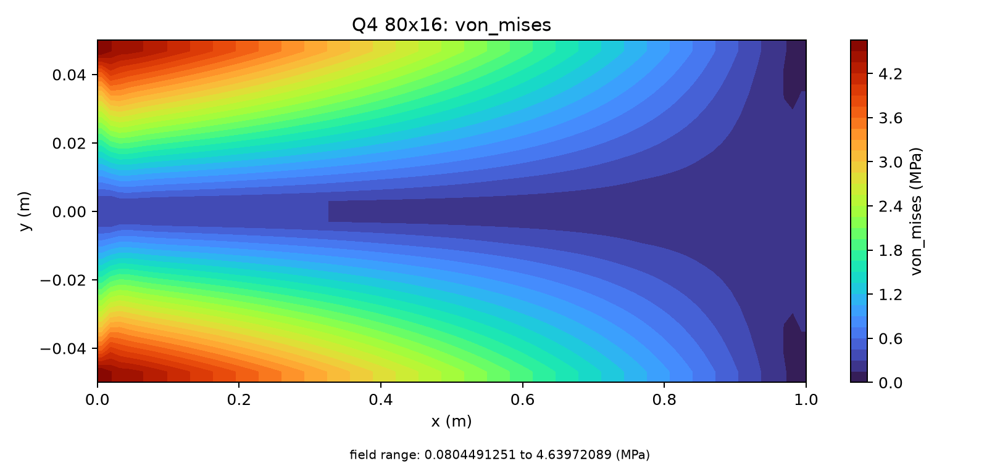
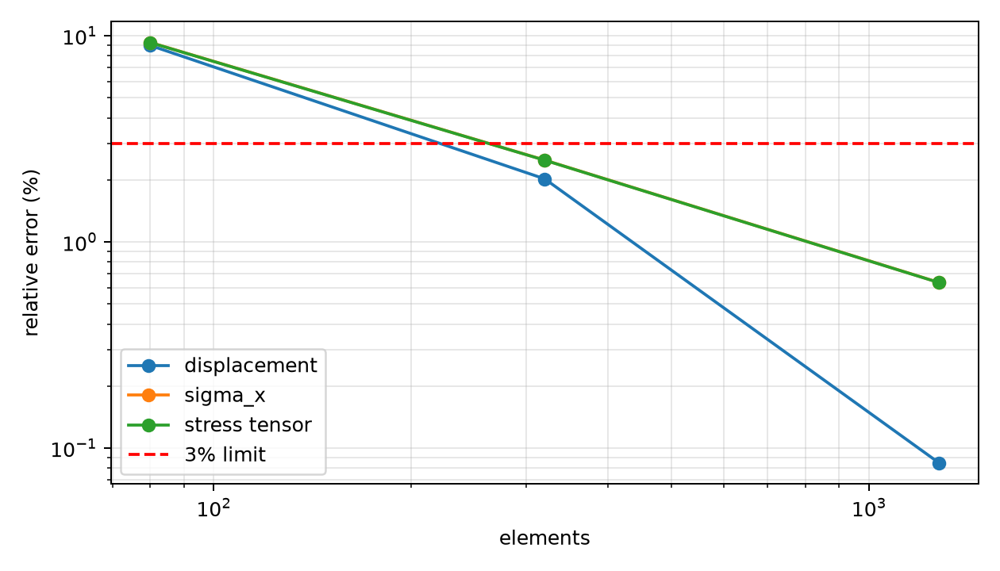

# 悬臂梁端载：位移与中部应力场验证报告

本次真实计算使用三组 Q4 网格。最细 80×16 网格的端位移相对误差为 **0.0846986%**，中部轴向应力 L2 误差为 **0.63553%**。这些量满足严格小于 3% 的门槛；固支端和端载区域的局部峰值应力没有获得认证。

## 1. 问题与计算条件

矩形条带长 L=1 m、高 H=0.1 m、厚 t=0.012 m，E=210 GPa、ν=0.30。左端整边固定 ux、uy，右端均布竖向载荷合力 P=-100 N。单元为全积分 Q4、线弹性平面应力，采用双精度求解。

端载按边段数分配并对两个角点取半权，确保总力等于 -100 N。全部网格、载荷和边界条件保持不变，仅加密两个方向。

## 2. 独立参考与验收范围

```text
I = t H³ / 12 = 1.0e-6 m⁴
v_ref(L) = P L³ / (3 E I) = -0.158730158730 mm
sigma_x_ref(x,y) = -P (L-x) y / I
sigma_y_ref = 0
tau_xy_ref(x,y) = P (H²/4-y²) / (2 I)
von_Mises_ref = sqrt(sigma_x_ref² + 3 tau_xy_ref²)
```

端位移采用 Euler–Bernoulli 工程参考。应力比较区在计算前固定为 **0.2L≤x≤0.8L 的全部单元中心**，覆盖截面高度，避免把固支约束和均布端载的局部二维效应当成梁理论误差。参考应力满足内部平衡；它是中部梁应力参考，不能充当当前二维边界条件的全域精确解。

应力误差为相同物理坐标的 `||s_FE-s_ref||₂/||s_ref||₂`，规则等面积网格中等同于面积加权 L2 比较。轴向、剪应力、完整应力张量和 von Mises 分别检验。参考分量为零时不做逐点除零，使用完整张量的非零范数。

## 3. 计算过程

1. 生成 20×4、40×8、80×16 网格并组装 Q4 刚度。
2. 求解位移，恢复单元中心 sigma_x、sigma_y、tau_xy 和 von Mises。
3. 由原始场再次计算端位移及应力误差，检查字段完整性、有限性、网格坐标和 von Mises 一致性。
4. 检查总载荷、反力平衡及三网格误差下降，最终网格的所有声明指标均须通过。

## 4. 真实计算结果与相对误差

| 网格 | 节点/单元 | 端位移 mm | 位移误差 | sigma_x L2 | tau_xy L2 | von Mises L2 | 网格状态 |
|---|---:|---:|---:|---:|---:|---:|---|
| 20×4 | 105/80 | -0.144485040 | 8.97442% | 9.28343% | 4.26283% | 9.22046% | blocked |
| 40×8 | 369/320 | -0.155519679 | 2.0226% | 2.49456% | 1.21054% | 2.4793% | qualified |
| 80×16 | 1377/1280 | -0.158595716 | 0.0846986% | 0.63553% | 0.31272% | 0.631762% | qualified |

完整应力张量的最细网格误差为 0.634669%。粗网格保留 blocked 标记，未把其数值改写成合格结果。位移和全部声明应力误差随网格加密下降。

| 网格 | 外力 N | 约束反力 N | 相对力不平衡 |
|---|---:|---:|---:|
| 20×4 | -100.000000000000 | 100.000000001190 | 1.19e-11 |
| 40×8 | -100.000000000000 | 99.999999998261 | 1.739e-11 |
| 80×16 | -100.000000000000 | 99.999999992090 | 7.91e-11 |

力平衡限为 1e-8，载荷相对误差限为 1e-10。

## 5. 位移、应力和误差云图











云图使用原始单元中心场的填色等值线，延伸到几何边界的图像采用相邻中心值延伸，属于显示插值。边界颜色不是新计算的边界应力；插值不参与任何误差或验收计算。

## 6. 能力边界与结论

该报告验证端位移以及声明中部区域的梁应力指标。不能据此声称全域峰值应力、塑性、接触或真实船体已达到 3% 精度。三网格应力收敛已验证，最终结果在上述范围内通过。

## 7. 复现与原始证据

```bash
python -m pip install -e ".[dev,reports]"
OMP_NUM_THREADS=1 PYTHONPATH=src .venv/bin/python scripts/run_cantilever_fe_benchmark.py --output docs/assets/benchmark-clouds/cantilever-fe/results.json
PYTHONPATH=src .venv/bin/python scripts/build_verified_benchmark_reports.py
```

[完整位移、应力、载荷及网格验收 JSON](../../assets/benchmark-clouds/cantilever-fe/results.json)。HTML、PDF、Word 位于相邻 exports 目录，内容来自本 Markdown，并包含全部云图和表格。
