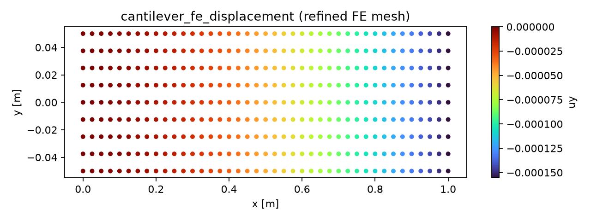
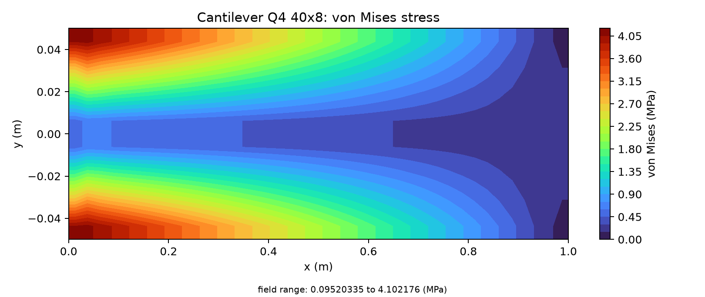

# 悬臂梁端部载荷：Q4 有限元验证报告

> 结论：`40×8` 网格的端部位移相对 Euler–Bernoulli 解误差为 **2.0226%**，低于 3% 验收限；总反力与外载荷的相对不平衡小于 `1.5×10⁻⁹%`。以下数值、误差和云图均来自仓库中实际求解结果，不是示意数据。

## 1. Benchmark 问题

矩形悬臂条带在 `x=0` 整边固支，在 `x=L` 端边施加合力 `P=-100 N` 的均布竖向载荷。采用平面应力 Q4 单元验证网格生成、刚度组装、约束、载荷传递、线性求解、反力和应力恢复链。

Euler–Bernoulli 参考解为：

```text
I = t H³ / 12
v(L) = P L³ / (3 E I)
σ_x(x,y) = -P (L-x) y / I
```

本例中 `I=1.0×10⁻⁶ m⁴`、`v_ref=-1.587301587×10⁻⁴ m`（`-0.158730159 mm`），根部外纤维名义弯曲应力为 `5.0 MPa`。

## 2. 计算条件

| 项目 | 数值或设置 |
|---|---:|
| 长度 `L` | `1.0 m` |
| 截面高度 `H` | `0.1 m` |
| 等效厚度 `t` | `0.012 m` |
| 弹性模量 `E` | `210 GPa` |
| 泊松比 `ν` | `0.30` |
| 端部合力 `P` | `-100 N` |
| 单元与假设 | 规则 Q4、线弹性、平面应力 |
| 边界条件 | `x=0` 的 `u_x=u_y=0` |
| 验收量 | 自由端中点竖向位移 |
| 验收门槛 | 相对误差 `<3%`，且位移场、应力场、反力均存在 |

端边载荷用梯形权重分配到节点，两个角点取半权，节点载荷总和严格等于 `-100 N`。

## 3. 计算过程

1. 分别生成 `20×4` 和 `40×8` 规则 Q4 网格。
2. 组装平面应力刚度矩阵和一致的端边等效节点力。
3. 施加左端固支约束并求解节点位移。
4. 从单元场恢复 von Mises 应力，从约束自由度汇总反力。
5. 将自由端中点位移与独立闭式解比较；误差按 `|v_FE-v_ref|/|v_ref|` 计算。

## 4. 真实计算结果

### 4.1 网格收敛与误差

| 网格 | 节点 / 单元 | FE 端部位移 (mm) | 参考值 (mm) | 相对误差 | 左端竖向反力 (N) | 最大单元 von Mises (MPa) | 状态 |
|---|---:|---:|---:|---:|---:|---:|---|
| `20×4` | `105 / 80` | `-0.144485037` | `-0.158730159` | `8.9744%` | `100.000000000009` | `3.184108` | `blocked` |
| `40×8` | `369 / 320` | `-0.155519675` | `-0.158730159` | **`2.0226%`** | `99.999999998545` | `4.102176` | **`qualified`** |

网格在两个方向各加密一倍后，位移误差从 `8.9744%` 降至 `2.0226%`，误差缩减为原来的 `0.2254`，两级结果对应的观测收敛阶约为 `2.15`。细网格最小节点竖向位移为 `-0.155532131 mm`，最大值为 `0`。

### 4.2 反力平衡

细网格竖向外载荷为 `-100 N`，约束反力为 `+99.999999998545 N`，力不平衡绝对值为 `1.455×10⁻⁹ N`，相对不平衡为 `1.455×10⁻⁹%`。因此载荷传递和反力回收闭合。

### 4.3 位移与应力云图

下图直接由 `40×8` 网格的节点位移场渲染。位移沿梁长单调增大，最大挠度出现在自由端，符合悬臂梁变形模式。



下图直接由相同求解结果的单元 von Mises 应力渲染。高应力集中在固支端外纤维，并沿梁长向自由端衰减；细网格单元中心最大值为 `4.102176 MPa`。该值是单元中心恢复值，不应与根部边界外纤维的 `5.0 MPa` 点值混同。



## 5. 误差解释与能力边界

粗网格因悬臂细长比和低阶 Q4 的弯曲离散误差未通过 3% 门槛；加密后端位移通过。反力在两级网格上均达到数值精度平衡，说明粗网格误差来自场离散而非漏载。应力表给出真实恢复值，但本案例的正式 3% 验收量是端位移；若要把根部峰值应力也作为认证量，应另行采用解析采样点一致化、网格外推或高阶单元标模。

本标模验证线弹性、小变形、规则连续体网格，不覆盖塑性、接触、几何非线性、裂纹或真实船体结构细节。

## 6. 复现与原始证据

```bash
PYTHONPATH=src .venv/bin/python scripts/run_cantilever_fe_benchmark.py \
  --output docs/assets/benchmark-clouds/cantilever-fe/results.json
python scripts/render_cantilever_fe_clouds.py \
  docs/assets/benchmark-clouds/cantilever-fe/results.json \
  --output-dir docs/assets/benchmark-clouds/cantilever-fe
```

正文已包含判定所需结果；[完整节点/单元场 JSON](../../assets/benchmark-clouds/cantilever-fe/results.json)仅作为审计和二次后处理数据。

## 7. 结论

该案例已完成真实 FE 求解、两级网格收敛、位移误差、反力平衡和位移/应力云图闭环。细网格端位移误差为 **2.0226%**，满足 `<3%` 的既定验收条件。
