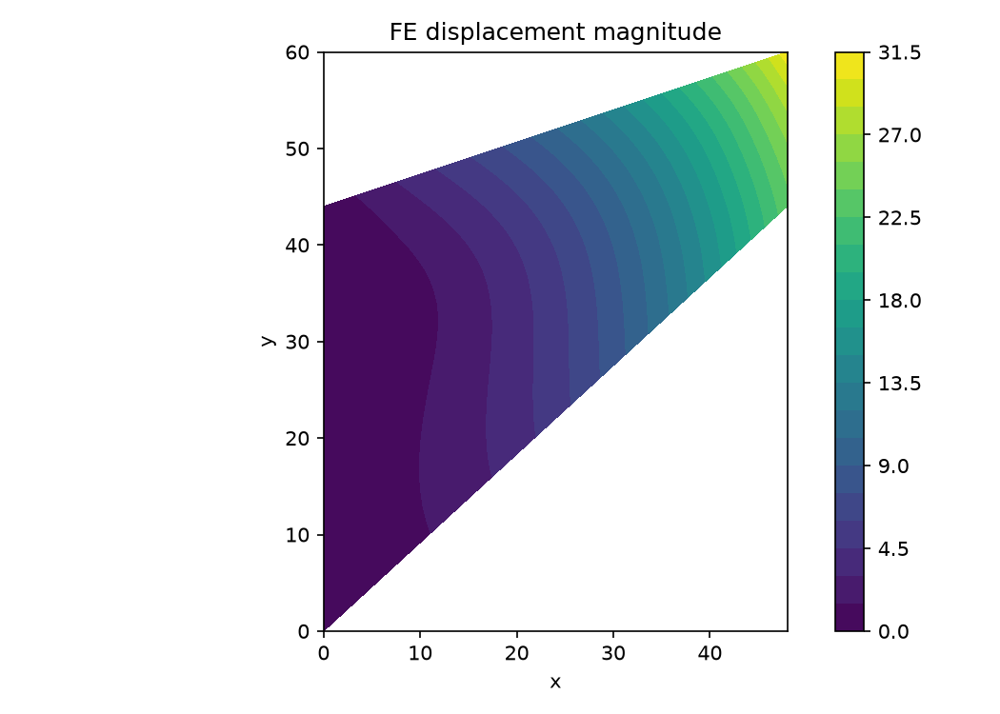
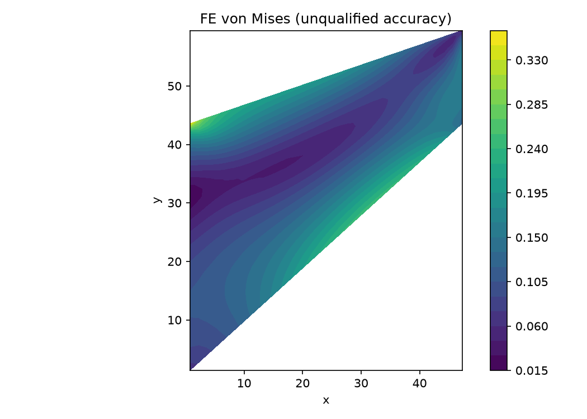
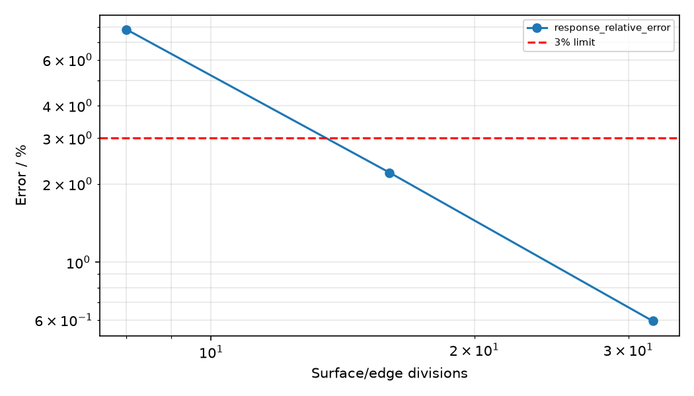

# Cook 膜：加载边中点位移与真实应力场

## 模型与求解

四角 (0,0),(48,44),(48,60),(0,44)，E=1，ν=1/3，厚度 1，平面应力。左边全固定，右边均布向上荷载的合力为 1。完全积分 Q4，稀疏 CG。数值采用 benchmark 单位。

## 独立参考与验收范围

项目沿用参考位移 23.96，采样位置为加载边中点 (48,52)。旧代码误用了右上角；该位置错误会在细网格上暴露。现在明确区分中点与角点，参考值未调整。当前报告未重新取得原始出版物中的数值表，外部来源溯源仍需补齐。

仅验证加载边中点位移与细化趋势。应力来自实际 FE 位移，通过中心 B 矩阵恢复；应力精度没有独立解析或高精度参考，不能宣布全场误差达标。

## 网格收敛结果

| 网格 | 指标 | 值 |
|---|---|---:|
| 8×8 | response_relative_error | 7.849819% |
| 8×8 | 本网格验收 | 未通过 |
| 16×16 | response_relative_error | 2.210304% |
| 16×16 | 本网格验收 | 通过 |
| 32×32 | response_relative_error | 0.594182% |
| 32×32 | 本网格验收 | 通过 |

## 求解与平衡复核

最细模型：1089 个节点，1024 个单元；双精度实际 FE 位移恢复上述应力。

Q4 使用 2×2 Gauss 完全积分。CG 容差 10⁻¹¹，实际相对残差 9.535e-12；位移探针值 23.8176339557。

## 场结果

## 结论与可复现证据

当前状态：**response-qualified**。验收严格遵循上文范围。

原始 JSON 包含全部节点、连接、位移及恢复应力，可重新计算误差；平滑绘图仅用于显示，不用于改变验收值。
[原始 FE 数据](../../assets/benchmark-clouds/cook-membrane/results.json)

运行：`OMP_NUM_THREADS=1 MKL_NUM_THREADS=1 PYTHONPATH=src .venv/bin/python scripts/rebuild_additional_benchmarks.py`。
