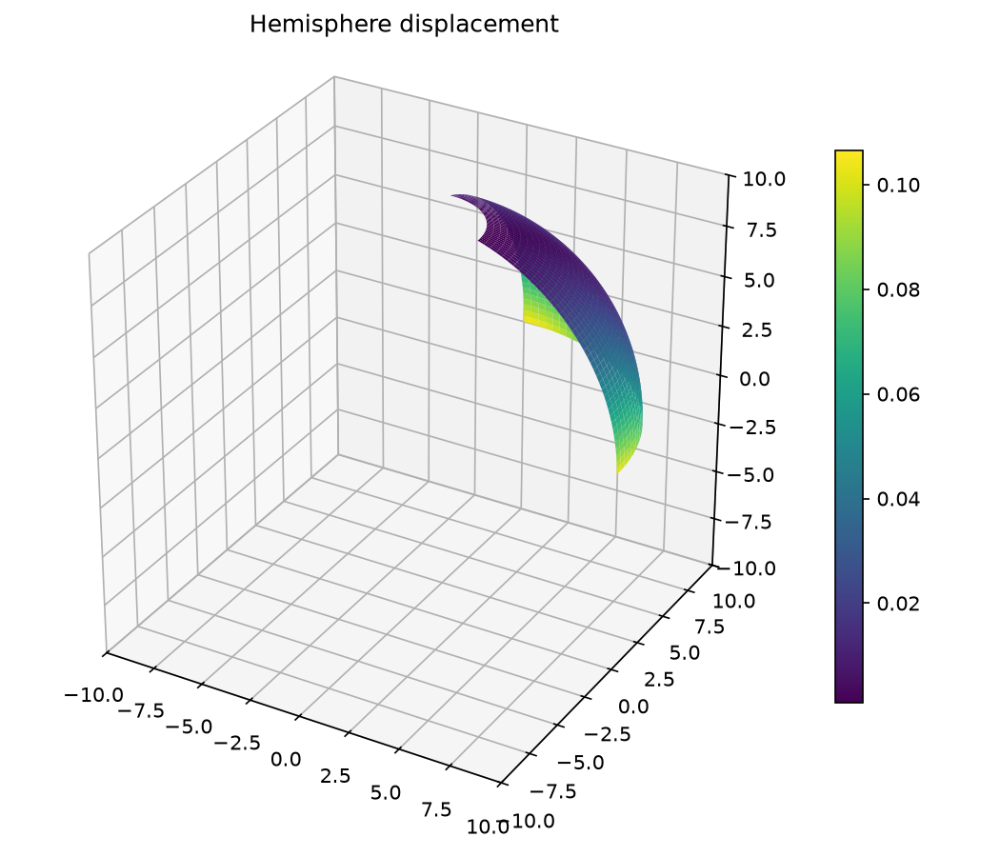
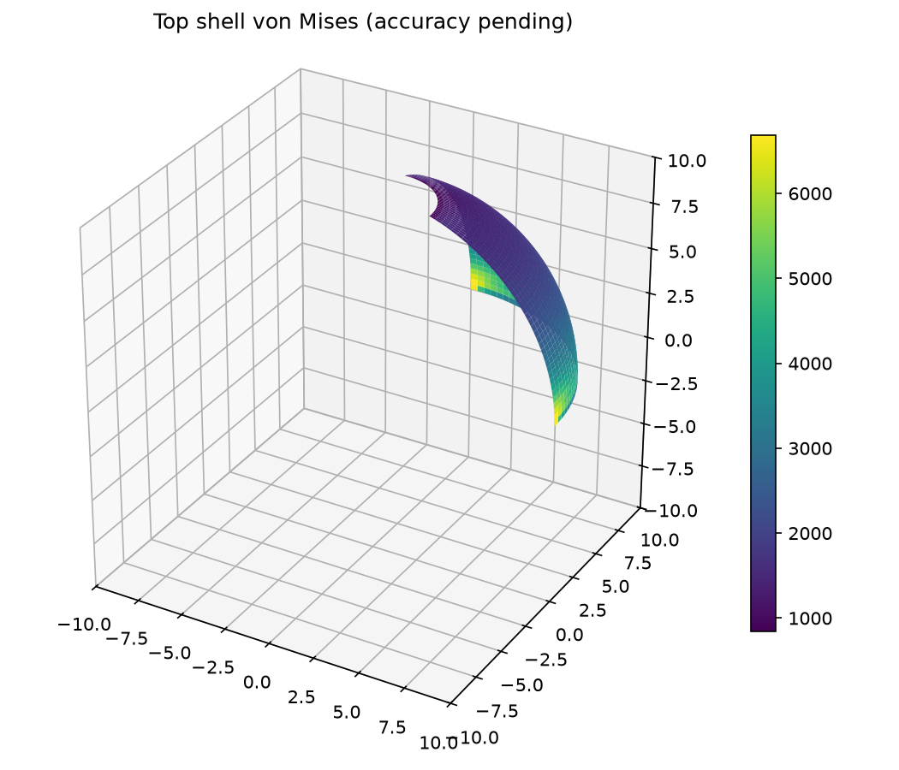
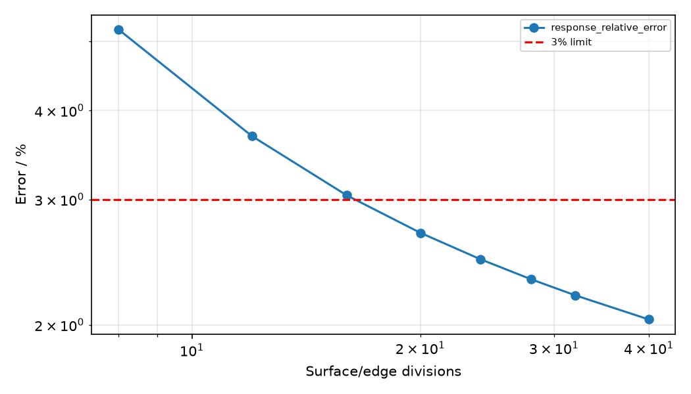

# 18° 开孔半球壳：修正后的位移收敛与应力场

## 模型与求解

R=10，t=0.04，E=6.825×10⁷，ν=0.3，18° 开孔四分之一半球，赤道两角交替径向单位力。对称面约束及一个垂直平移规范约束。基准长度/力单位保持原定义。

## 独立参考与验收范围

MacNeal–Harder (1985)，DOI 10.1016/0168-874X(85)90003-4，沿用加载赤道点参考径向位移 0.0924。局部 Mindlin 坐标导数转换已修正为逆转置，消除了斜网格刚体转动的虚假刚度。旧 12×12 的 0.69% 误差记录作废。

默认 drilling_factor=10⁻⁶ 的点位移收敛与平衡单独验证。表面应力由局部膜应变±tκ/2恢复；没有独立应力参考。两数量级 drilling 参数检查独立列出，失败会阻止整体稳健性资格，禁止选参数贴合参考。

## 网格收敛结果

| 网格 | 指标 | 值 |
|---|---|---:|
| 8×8 | response_relative_error | 5.200217% |
| 8×8 | 本网格验收 | 未通过 |
| 12×12 | response_relative_error | 3.681648% |
| 12×12 | 本网格验收 | 未通过 |
| 16×16 | response_relative_error | 3.040050% |
| 16×16 | 本网格验收 | 未通过 |
| 20×20 | response_relative_error | 2.693225% |
| 20×20 | 本网格验收 | 通过 |
| 24×24 | response_relative_error | 2.472504% |
| 24×24 | 本网格验收 | 通过 |
| 28×28 | response_relative_error | 2.317068% |
| 28×28 | 本网格验收 | 通过 |
| 32×32 | response_relative_error | 2.200374% |
| 32×32 | 本网格验收 | 通过 |
| 40×40 | response_relative_error | 2.035156% |
| 40×40 | 本网格验收 | 通过 |

## 求解与平衡复核

最细模型：1681 个节点，1600 个单元；双精度实际 FE 位移恢复上述应力。

线性投影 Q4 壳每节点六自由度，膜与板采用选择性积分。自由残差范数 1.556e-08，合力相对误差 2.919e-09，合矩相对误差 2.002e-09；门槛 10⁻⁷。

## 参数稳健性

| drilling factor（40×40） | 位移误差 | 全部验收 |
|---|---:|---|
| 1e-07 | 2.919689% | 通过 |
| 1e-06 | 2.035156% | 通过 |
| 1e-05 | 1.479970% | 通过 |

末两级默认参数点位移变化：0.161661%。

保留的 24×24 参数检查：

| drilling factor | 位移误差 | 验收 |
|---|---:|---|
| 1e-07 | 4.005104% | 未通过 |
| 1e-06 | 2.472504% | 通过 |
| 1e-05 | 1.494037% | 通过 |

40×40 的全部参数通过不消除上述粗网格失败记录。

## 场结果

## 结论与可复现证据

当前状态：**response-qualified**。验收严格遵循上文范围。

原始 JSON 包含全部节点、连接、位移及恢复应力，可重新计算误差；平滑绘图仅用于显示，不用于改变验收值。
[原始 FE 数据](../../assets/benchmark-clouds/hemisphere-hole/results.json)

运行：`OMP_NUM_THREADS=1 MKL_NUM_THREADS=1 PYTHONPATH=src .venv/bin/python scripts/rebuild_additional_benchmarks.py`。
