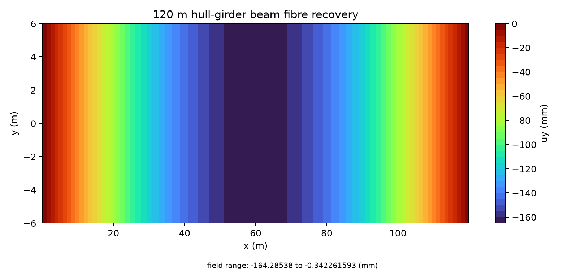
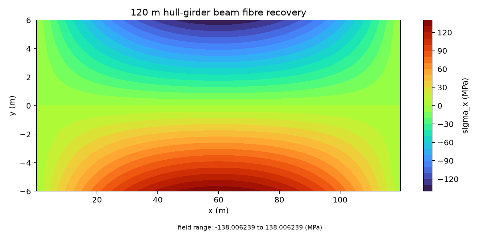
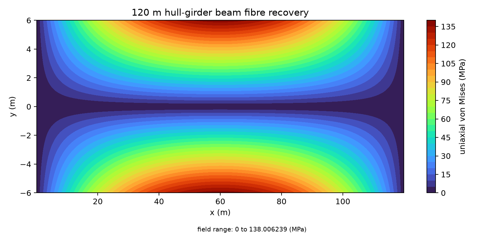
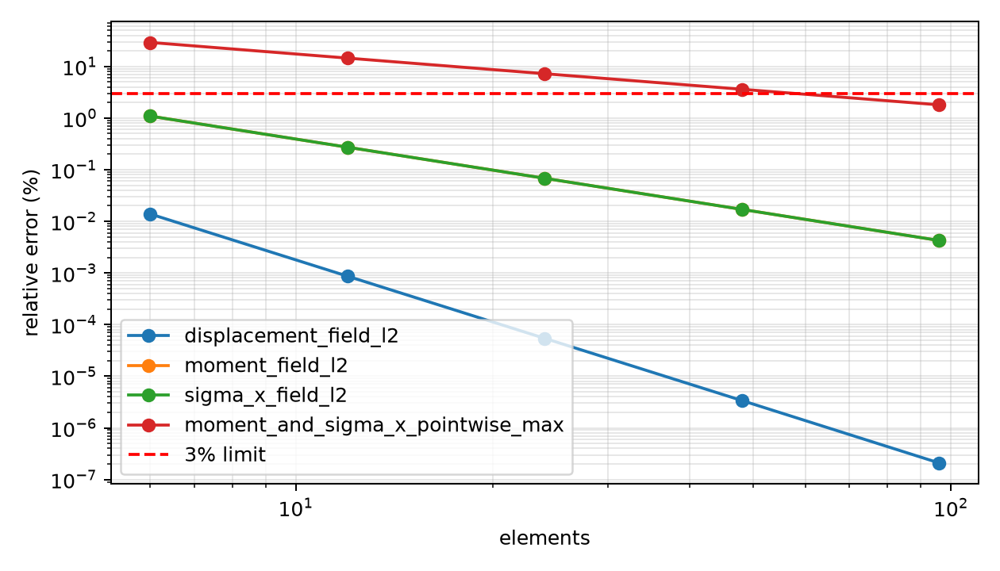

# 120 m 船体梁纵向弯曲：真实 Frame FE 场与误差研究报告

本报告采用 120 m 两端简支梁、均布静水和波浪等效线载荷，与 1 m 固支端载 Q4 悬臂梁具有不同边界、载荷和单元。旧版同模型换标题的船体梁报告已由本独立力学问题替换。

## 1. 问题与计算条件

| 条件 | 数值 |
|---|---:|
| 船体梁长度 L | 120 m |
| E | 210 GPa |
| 等效截面面积 A | 5 m² |
| 等效惯性矩 I | 180 m⁴ |
| 静水等效向下载荷 | 1.4 MN/m |
| 波浪等效向下载荷 | 0.9 MN/m |
| 总向下载荷 q | 2.3 MN/m |
| 应力输出纤维 | y=-6 至 +6 m，共 25 层 |
| 单元 | Euler–Bernoulli Frame2D |
| 边界 | 左端 ux、uy 固定；右端 uy 固定，转角自由 |
| 网格 | 6、12、24 单元 |

A、I 是输入等效截面属性，y 轴表示梁纤维的竖向坐标，图像不是实际船体壳网格。均布载荷使用单元一致节点力和节点力矩。

## 2. 独立解析参考

```text
v(x) = -q x (L³-2 L x²+x³)/(24 E I)
M(x) = q x (L-x)/2
sigma_x(x,y) = -M(x) y/I
v_mid magnitude = 0.164285714286 m
M_mid = 4.14e9 N m
support reaction = q L/2 = 138e6 N each
```

更严格的逐点检查显示：最细网格的弯矩和非零纤维应力最大相对误差为 **1.80239%**，出现在 x=119.921875 m 的近支座采样点。该项小于 3%；逐点最大误差与 L2 均纳入当前验收，未通过的粗网格保留。

计算应力由 FE 位移和转角的 Hermite 二阶导数获得 `sigma_x_FE=-E y v_FE''`，没有用解析弯矩替代 FE 应力。每个单元取八个预定内部采样点，在相同物理坐标比较位移、弯矩和 25 层纤维应力的 L2 范数。

## 3. 计算过程

生成五网格模型并求解 Frame 静力方程；保存完整节点位移、转角、单元端力和支座反力。由节点自由度独立恢复全部场，验证存储场与恢复场一致，然后与解析式比较。五网格场误差下降且最终误差小于 3% 才通过。

## 4. 真实计算结果与相对误差

| 单元数 | 中部挠度 m | 中部挠度误差 | 位移场 L2 | 弯矩场 L2 | sigma_x 场 L2 | 逐点应力最大误差 | 总反力 N | 相对力不平衡 |
|---|---:|---:|---:|---:|---:|---:|---:|---:|
| 6 (fail) | 0.164285714 | 7.77156e-13% | 0.0138579% | 1.08958% | 1.08958% | 29.1228% | 276000000.00000 | 8.638e-15 |
| 12 (fail) | 0.164285714 | 1.82854e-11% | 0.000866121% | 0.272395% | 0.272395% | 14.4852% | 275999999.99995 | 1.797e-13 |
| 24 (fail) | 0.164285714 | 2.28007e-10% | 5.41327e-05% | 0.0680988% | 0.0680988% | 7.22367% | 275999999.99964 | 1.299e-12 |
| 48 (fail) | 0.164285714 | 8.0147e-10% | 3.38388e-06% | 0.0170247% | 0.0170247% | 3.60713% | 275999999.99789 | 7.629e-12 |
| 96 (pass) | 0.164285714 | 3.29059e-09% | 2.09073e-07% | 0.00425618% | 0.00425618% | 1.80239% | 276000000.00781 | 2.831e-11 |

最细网格 24 单元的 FE 纤维应力范围为 -138.006239 至 138.006239 MPa。节点中部挠度在舍入精度内准确，而位移插值和曲率应力场仍有离散误差，故验收检查完整采样场，没有用单个精确节点掩盖应力误差。

## 5. 位移、应力及网格误差图









云图直接使用 FE 自由度恢复的梁纤维场，颜色插值仅用于显示。该模型没有计算壳局部剪切、板格应力或三维 von Mises，应力图严格标注为单轴梁纤维结果。

## 6. 结论与能力边界

全长采样位移、弯矩与轴向纤维应力在五网格下收敛，最终的 L2 范数误差均低于 3%，最细网格逐点弯矩/非零纤维应力最大误差也低于 3%，支座反力与总载荷闭合。该案例是理想化船体梁弯曲验证，未认证船体扭转、剪切迟滞、舱口局部应力、屈曲、塑性极限强度或船级社规则。

## 7. 复现与原始证据

```bash
OMP_NUM_THREADS=1 PYTHONPATH=src .venv/bin/python scripts/run_hull_girder_fe_benchmark.py --output docs/assets/benchmark-clouds/hull-girder/hull-girder-fe.json
PYTHONPATH=src .venv/bin/python scripts/build_verified_benchmark_reports.py
```

[完整节点自由度、单元端力、纤维场及误差 JSON](../../assets/benchmark-clouds/hull-girder/hull-girder-fe.json)。HTML、PDF、Word 位于 exports 目录。
