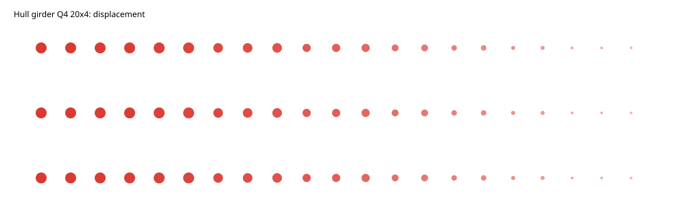
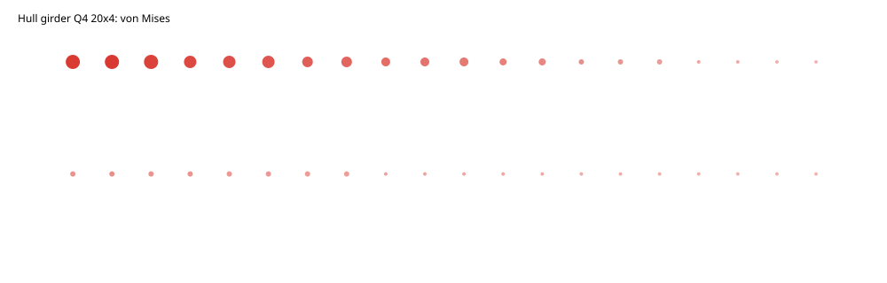
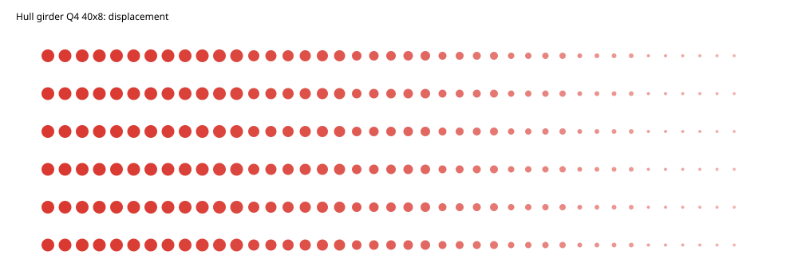
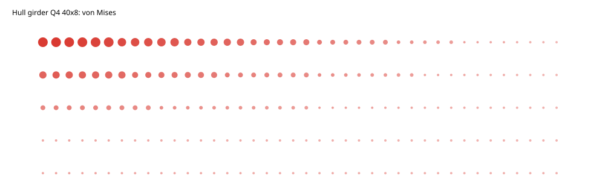

# 船体梁纵向弯曲：Q4 有限元验证报告

> 结论：细网格 `40×8` 的自由端位移误差为 **2.0226%**，通过 3% 门槛；竖向反力与载荷的不平衡小于 `4.8×10⁻⁹%`。本报告直接列出计算结果并内嵌四幅真实 FE 场图。

## 1. Benchmark 问题与用途

将船体梁抽象为焊接等效矩形条带，以透明、可独立复核的 Euler–Bernoulli 解检查 TensorFEM 的纵向弯曲求解链。模型左端固支，右端施加向下合力。本案例是求解器验证，不是船级社规范校核，也不代表带纵骨、开孔、焊缝和腐蚀的实船模型。

参考关系为：

```text
I = t H³ / 12 = 1.0×10⁻⁶ m⁴
v_ref(L) = P L³ / (3 E I) = -1.587301587×10⁻⁴ m
M_root = |P|L = 100 N·m
σ_root,outer = M_root(H/2)/I = 5.0 MPa
```

## 2. 计算条件

| 项目 | 数值或设置 |
|---|---:|
| 梁长 `L` | `1.0 m` |
| 型深 `H` | `0.10 m` |
| 等效厚度 `t` | `0.012 m` |
| `E, ν` | `210 GPa, 0.30` |
| 自由端合力 `P` | `-100 N` |
| 单元 | 平面应力 Q4 |
| 左端边界 | 整个截面 `u_x=u_y=0` |
| 网格 | `20×4`、`40×8` |
| 验收量和门槛 | 端部中点位移相对误差 `<3%` |

端边合力按线载荷的梯形积分分配，端边角点为半权重，保证输入的节点载荷合计为 `-100 N`。

## 3. 计算过程

网格生成后组装 Q4 平面应力刚度矩阵，施加边界与端边载荷，求解位移；随后恢复单元 von Mises 应力并从约束自由度计算反力。每级网格都保存完整节点位移和单元应力，而不是仅保存截图或人工抄录的摘要值。

## 4. 真实计算结果

### 4.1 数值、误差与判定

| 网格 | 节点 / 单元 | FE 端部位移 (mm) | 参考值 (mm) | 相对误差 | 左端反力 `R_y` (N) | 最大 von Mises (MPa) | 判定 |
|---|---:|---:|---:|---:|---:|---:|---|
| `20×4` | `105 / 80` | `-0.144485040` | `-0.158730159` | `8.9744%` | `100.000000001105` | `3.184108` | `blocked` |
| `40×8` | `369 / 320` | `-0.155519679` | `-0.158730159` | **`2.0226%`** | `99.999999995206` | `4.102177` | **`qualified`** |

加密后误差缩减到粗网格的 `22.54%`，两级数据给出的观测收敛阶约为 `2.15`。粗网格未被“报告层”提升状态；只有细网格因为实际误差低于门槛而通过。

### 4.2 反力闭合

细网格外载荷为 `-100 N`，竖向反力为 `+99.999999995206 N`，绝对不平衡 `4.794×10⁻⁹ N`，相对不平衡 `4.794×10⁻⁹%`。这验证了端边载荷积分、约束和反力回收的一致性。

### 4.3 粗网格场结果

粗网格位移场已显示正确的悬臂弯曲形态，但幅值不足，因此仍为 `blocked`。



粗网格应力场在固支端上下外纤维达到最大，并向自由端衰减。



### 4.4 细网格场结果

细网格最小节点竖向位移为 `-0.155532135 mm`，自由端中点位移为 `-0.155519679 mm`；两者的轻微差别来自二维泊松效应和端部局部变形。



细网格最大单元中心 von Mises 应力为 `4.102177 MPa`。其位置在固支端附近；解析的 `5.0 MPa` 是边界外纤维点值，两者采样位置不同，因此本报告不把二者伪装成同点应力误差。



## 5. 误差分析与适用边界

低阶 Q4 在细长构件弯曲中存在网格相关的刚度偏高，表现为粗网格挠度偏小；规则加密后位移单调接近闭式解并跨过 3% 验收线。反力始终闭合，排除了漏载或错误载荷总量。应力云图用于验证场恢复、分布和数量级；正式通过量仍是端位移。

本案例不包含船体纵骨离散建模、舱口、初始缺陷、屈曲/后屈曲、材料塑性、波浪载荷、流固耦合和规范安全系数。这些能力必须由独立标模验证，不能用本结果替代。

## 6. 复现与原始证据

```bash
PYTHONPATH=src .venv/bin/python scripts/run_hull_girder_fe_benchmark.py \
  --output docs/assets/benchmark-clouds/hull-girder/hull-girder-fe.json
PYTHONPATH=src .venv/bin/python scripts/render_hull_girder_fe_clouds.py \
  docs/assets/benchmark-clouds/hull-girder/hull-girder-fe.json \
  --output-dir docs/assets/benchmark-clouds/hull-girder
```

正文已给出完整判定数据；[原始 FE JSON](../../assets/benchmark-clouds/hull-girder/hull-girder-fe.json)提供节点级与单元级审计数据，[独立 HTML 产物](../../assets/benchmark-clouds/hull-girder/hull-girder-fe.html)用于离线浏览。

## 7. 结论

船体梁案例已形成“理论参考—真实求解—网格收敛—反力平衡—场云图—误差判定”的闭环。`40×8` 网格位移误差 **2.0226%**，满足 `<3%` 验收要求。
