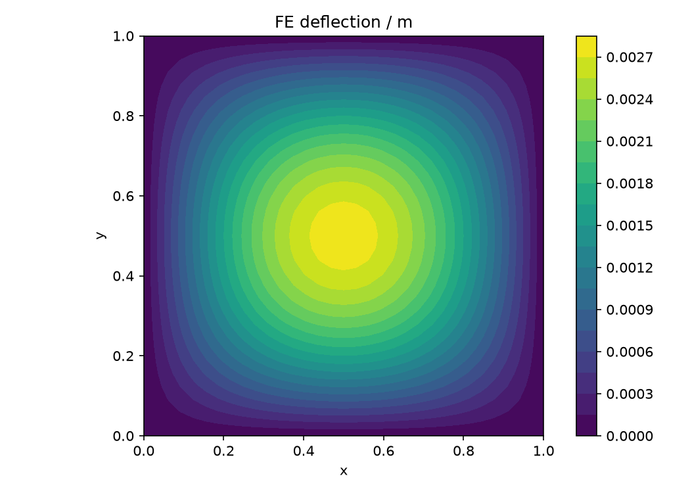
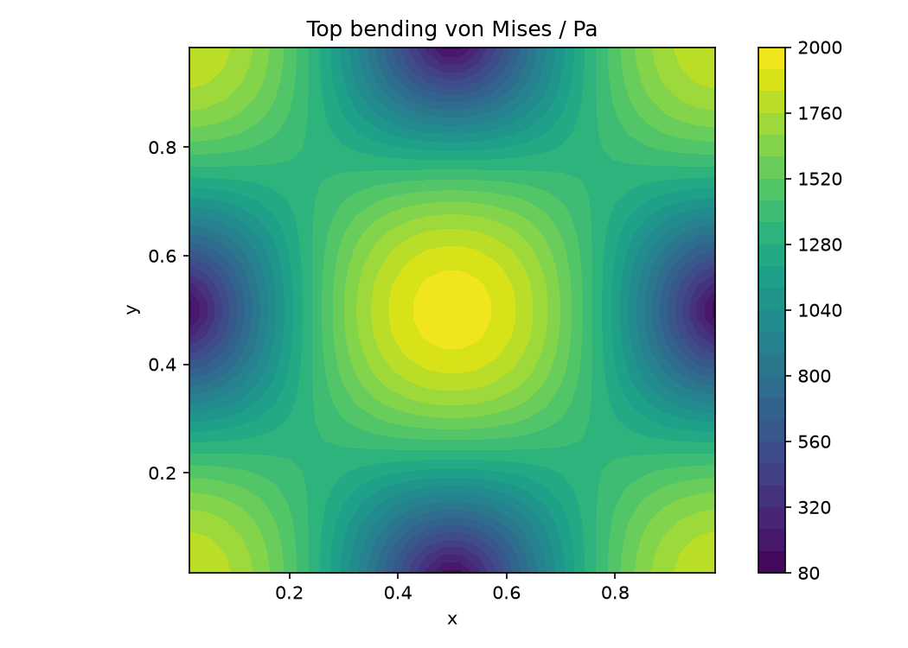
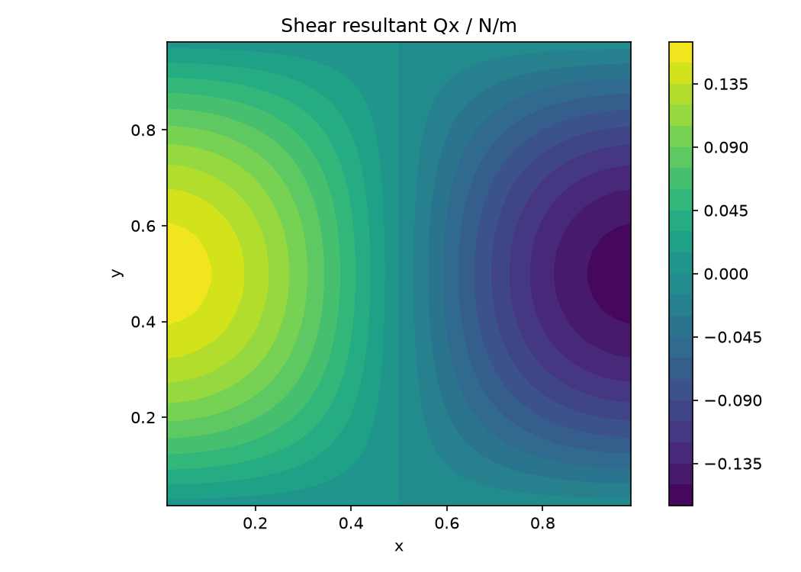
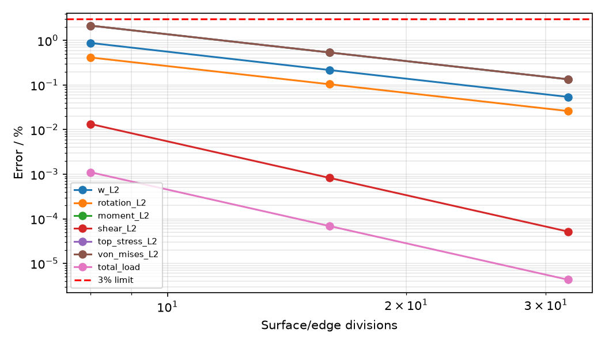

# Mindlin 简支板：正弦荷载与 Navier 精确解

## 模型与求解

边长 1 m，E=10 MPa，ν=0.3，厚度 0.01 m，荷载 q=sin(πx)sin(πy) Pa。硬简支边界：w=0，切向转角=0；Q4 Mindlin 选择性积分，剪切修正系数 5/6。

## 独立参考与验收范围

令 k=π，λ=2k²，D=Et³/[12(1−ν²)]，Ds=(5/6)Gt，Wb=q0/(Dλ²)，Ws=q0/(Dsλ)。精确 w=(Wb+Ws)sin(kx)sin(ky)，θx=−kWb cos(kx)sin(ky)，θy=−kWb sin(kx)cos(ky)。κ=(k²Wb sin sin,k²Wb sin sin,−2k²Wb cos cos)，M=Dbκ；Q=(kq0/λ)(cos sin,sin cos)，表面弯曲应力 σ=6M/t²。

节点挠度和转角 L2，单元中心弯矩、横向剪力、上表面弯曲应力及 von Mises L2，外加总荷载积分误差。参考与 FE 使用相同坐标但独立公式。通过只覆盖 Mindlin 模型的弯曲应力与剪力，不涵盖三维厚度方向应力。

## 网格收敛结果

| 网格 | 指标 | 值 |
|---|---|---:|
| 8×8 | w_L2 | 0.877103% |
| 8×8 | rotation_L2 | 0.414681% |
| 8×8 | moment_L2 | 2.146360% |
| 8×8 | shear_L2 | 0.013363% |
| 8×8 | top_stress_L2 | 2.146360% |
| 8×8 | von_mises_L2 | 2.146360% |
| 8×8 | total_load | 0.001106% |
| 8×8 | 本网格验收 | 通过 |
| 16×16 | w_L2 | 0.217094% |
| 16×16 | rotation_L2 | 0.104237% |
| 16×16 | moment_L2 | 0.537746% |
| 16×16 | shear_L2 | 0.000828% |
| 16×16 | top_stress_L2 | 0.537746% |
| 16×16 | von_mises_L2 | 0.537746% |
| 16×16 | total_load | 0.000069% |
| 16×16 | 本网格验收 | 通过 |
| 32×32 | w_L2 | 0.054139% |
| 32×32 | rotation_L2 | 0.026093% |
| 32×32 | moment_L2 | 0.134510% |
| 32×32 | shear_L2 | 0.000052% |
| 32×32 | top_stress_L2 | 0.134510% |
| 32×32 | von_mises_L2 | 0.134510% |
| 32×32 | total_load | 0.000004% |
| 32×32 | 本网格验收 | 通过 |

## 求解与平衡复核

最细模型：1089 个节点，1024 个单元；双精度实际 FE 位移恢复上述应力。

弯曲采用 2×2 Gauss 积分，剪切采用中心积分；全自由 DOF 相对残差 5.830e-11，反力与荷载合力误差 4.679e-13；均须低于 10⁻⁸。

## 场结果

## 结论与可复现证据

当前状态：**qualified**。验收严格遵循上文范围。

原始 JSON 包含全部节点、连接、位移及恢复应力，可重新计算误差；平滑绘图仅用于显示，不用于改变验收值。
[原始 FE 数据](../../assets/benchmark-clouds/mindlin-navier/results.json)

运行：`OMP_NUM_THREADS=1 MKL_NUM_THREADS=1 PYTHONPATH=src .venv/bin/python scripts/rebuild_additional_benchmarks.py`。
