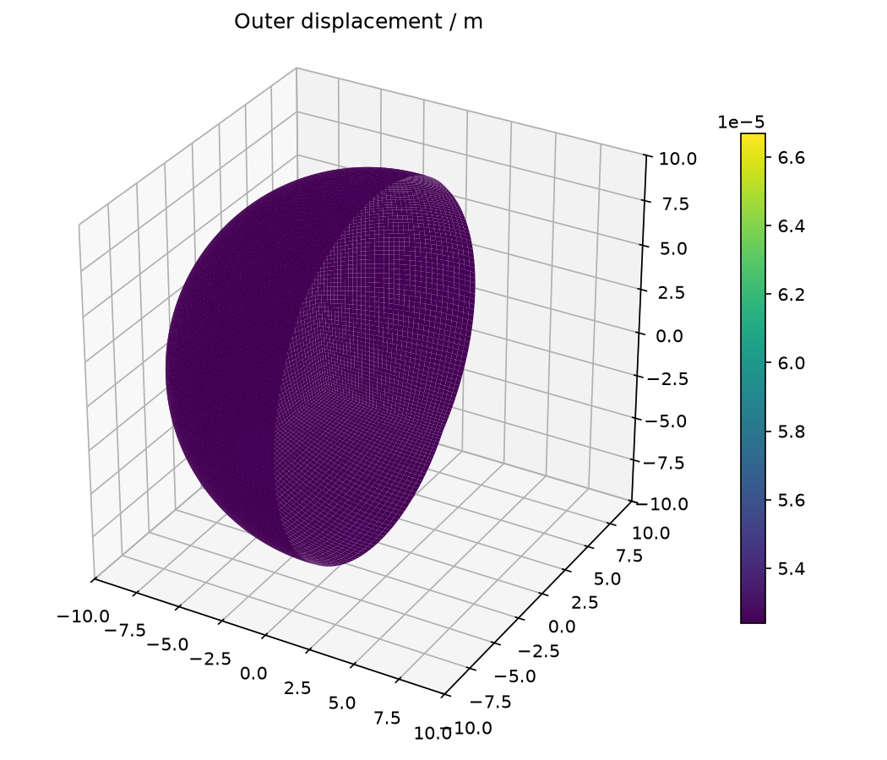
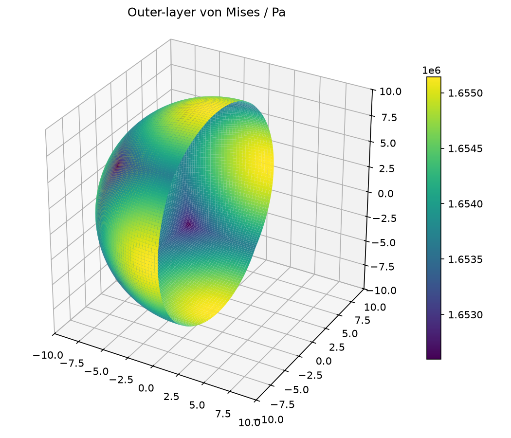
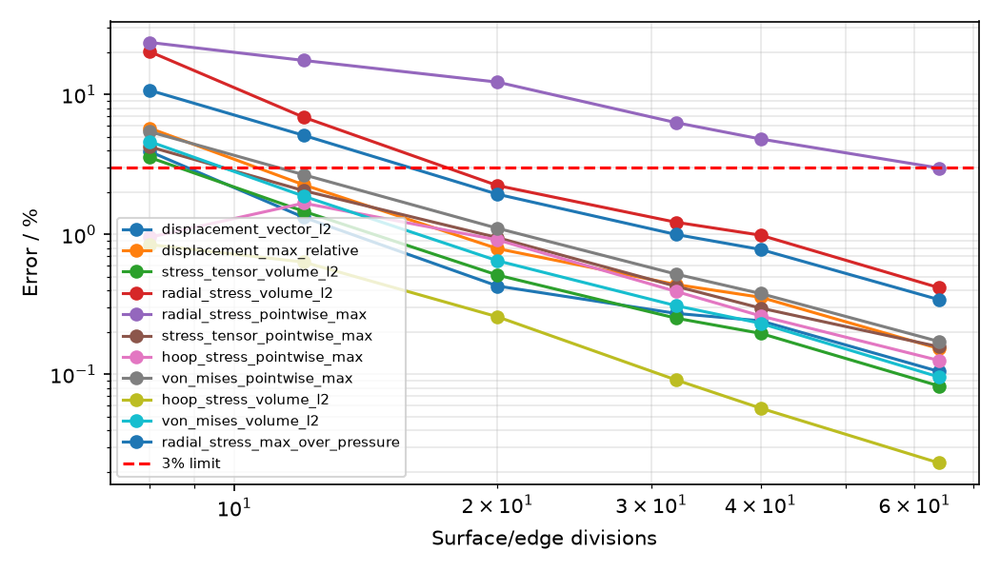

# 三维厚球壳内压：HEX8 与 Lamé 精确解

## 模型与求解

内外半径 8/10 m，E=210 GPa，ν=0.3，内压 1 MPa，外压为零。完整球体使用 HEX8；三个坐标轴处的六个切向约束只消除刚体运动，径向膨胀自由。内压在离散内表面一致积分。

## 独立参考与验收范围

独立精确解：A=p a³/(b³−a³)，B=p a³b³/(b³−a³)；σr=A−B/r³，σt=A+B/(2r³)，ur=[(1−2ν)Ar+(1+ν)B/(2r²)]/E。由球对称平衡 dσr/dr+2(σr−σt)/r=0 及内外表面 σr(a)=−p、σr(b)=0 得到；结合三维 Hooke 定律确定位移。参考解不参与装配与载荷。

位移向量全节点 L2/最大相对误差、中心应力张量/径向/环向/von Mises 的体积加权 L2，径向最大绝对误差除以内压。最后一项避免外表面零应力造成相对误差奇异。全部声明误差须低于 3%。原有范数指标在全部网格级别下降；所有指标（含逐点最大误差）须在预定 20/32/40/64 细化段下降。8/12 粗网格的环向逐点最大误差非单调，记录保留；粗网格失败保留。应力取单元中心，没有边界峰值外推。 逐点检查：径向应力最大相对误差 2.979011%；通过每个径向应力采样点小于 3% 的门槛。当前验收同时检查全节点位移，以及全部单元中心应力张量、径向、环向和 von Mises 的逐点最大相对误差；粗网格超标记录保留。

## 网格收敛结果

| 网格 | 指标 | 值 |
|---|---|---:|
| 8×8×1 | displacement_vector_l2 | 3.909015% |
| 8×8×1 | displacement_max_relative | 5.741382% |
| 8×8×1 | stress_tensor_volume_l2 | 3.544552% |
| 8×8×1 | radial_stress_volume_l2 | 20.245010% |
| 8×8×1 | radial_stress_pointwise_max | 23.546869% |
| 8×8×1 | stress_tensor_pointwise_max | 4.228826% |
| 8×8×1 | hoop_stress_pointwise_max | 0.952984% |
| 8×8×1 | von_mises_pointwise_max | 5.417955% |
| 8×8×1 | hoop_stress_volume_l2 | 0.845141% |
| 8×8×1 | von_mises_volume_l2 | 4.606789% |
| 8×8×1 | radial_stress_max_over_pressure | 10.713864% |
| 8×8×1 | 本网格验收 | 未通过 |
| 12×12×2 | displacement_vector_l2 | 1.324681% |
| 12×12×2 | displacement_max_relative | 2.261922% |
| 12×12×2 | stress_tensor_volume_l2 | 1.462434% |
| 12×12×2 | radial_stress_volume_l2 | 6.877598% |
| 12×12×2 | radial_stress_pointwise_max | 17.515657% |
| 12×12×2 | stress_tensor_pointwise_max | 2.054036% |
| 12×12×2 | hoop_stress_pointwise_max | 1.672291% |
| 12×12×2 | von_mises_pointwise_max | 2.669418% |
| 12×12×2 | hoop_stress_volume_l2 | 0.634036% |
| 12×12×2 | von_mises_volume_l2 | 1.875641% |
| 12×12×2 | radial_stress_max_over_pressure | 5.104749% |
| 12×12×2 | 本网格验收 | 未通过 |
| 20×20×4 | displacement_vector_l2 | 0.427341% |
| 20×20×4 | displacement_max_relative | 0.790669% |
| 20×20×4 | stress_tensor_volume_l2 | 0.511502% |
| 20×20×4 | radial_stress_volume_l2 | 2.233094% |
| 20×20×4 | radial_stress_pointwise_max | 12.257342% |
| 20×20×4 | stress_tensor_pointwise_max | 0.947328% |
| 20×20×4 | hoop_stress_pointwise_max | 0.912603% |
| 20×20×4 | von_mises_pointwise_max | 1.105005% |
| 20×20×4 | hoop_stress_volume_l2 | 0.257437% |
| 20×20×4 | von_mises_volume_l2 | 0.647632% |
| 20×20×4 | radial_stress_max_over_pressure | 1.935864% |
| 20×20×4 | 本网格验收 | 未通过 |
| 32×32×4 | displacement_vector_l2 | 0.272445% |
| 32×32×4 | displacement_max_relative | 0.438200% |
| 32×32×4 | stress_tensor_volume_l2 | 0.251912% |
| 32×32×4 | radial_stress_volume_l2 | 1.221159% |
| 32×32×4 | radial_stress_pointwise_max | 6.292870% |
| 32×32×4 | stress_tensor_pointwise_max | 0.425529% |
| 32×32×4 | hoop_stress_pointwise_max | 0.391152% |
| 32×32×4 | von_mises_pointwise_max | 0.520131% |
| 32×32×4 | hoop_stress_volume_l2 | 0.091163% |
| 32×32×4 | von_mises_volume_l2 | 0.309331% |
| 32×32×4 | radial_stress_max_over_pressure | 0.998360% |
| 32×32×4 | 本网格验收 | 未通过 |
| 40×40×4 | displacement_vector_l2 | 0.241126% |
| 40×40×4 | displacement_max_relative | 0.355091% |
| 40×40×4 | stress_tensor_volume_l2 | 0.196053% |
| 40×40×4 | radial_stress_volume_l2 | 0.986745% |
| 40×40×4 | radial_stress_pointwise_max | 4.806158% |
| 40×40×4 | stress_tensor_pointwise_max | 0.297139% |
| 40×40×4 | hoop_stress_pointwise_max | 0.261228% |
| 40×40×4 | von_mises_pointwise_max | 0.377508% |
| 40×40×4 | hoop_stress_volume_l2 | 0.057219% |
| 40×40×4 | von_mises_volume_l2 | 0.231227% |
| 40×40×4 | radial_stress_max_over_pressure | 0.779927% |
| 40×40×4 | 本网格验收 | 未通过 |
| 64×64×6 | displacement_vector_l2 | 0.104625% |
| 64×64×6 | displacement_max_relative | 0.152505% |
| 64×64×6 | stress_tensor_volume_l2 | 0.082488% |
| 64×64×6 | radial_stress_volume_l2 | 0.415483% |
| 64×64×6 | radial_stress_pointwise_max | 2.979011% |
| 64×64×6 | stress_tensor_pointwise_max | 0.157272% |
| 64×64×6 | hoop_stress_pointwise_max | 0.125486% |
| 64×64×6 | von_mises_pointwise_max | 0.171411% |
| 64×64×6 | hoop_stress_volume_l2 | 0.023233% |
| 64×64×6 | von_mises_volume_l2 | 0.095565% |
| 64×64×6 | radial_stress_max_over_pressure | 0.341260% |
| 64×64×6 | 本网格验收 | 通过 |

## 求解与平衡复核

最细模型：172046 个节点，147456 个单元；双精度实际 FE 位移恢复上述应力。

Jacobi-PCG (CSR)：375 次迭代，自由残差 9.800e-12，规范约束反力 1.639e-15；载荷合力/合矩误差 5.656e-15/4.197e-15。平衡门槛 10⁻⁸。

## 场结果

## 结论与可复现证据

当前状态：**qualified**。验收严格遵循上文范围。

原始 JSON 包含全部节点、连接、位移及恢复应力，可重新计算误差；平滑绘图仅用于显示，不用于改变验收值。
[原始 FE 数据](../../assets/benchmark-clouds/sphere-pressure/results.json)

运行：`OMP_NUM_THREADS=1 MKL_NUM_THREADS=1 PYTHONPATH=src .venv/bin/python scripts/rebuild_additional_benchmarks.py`。
