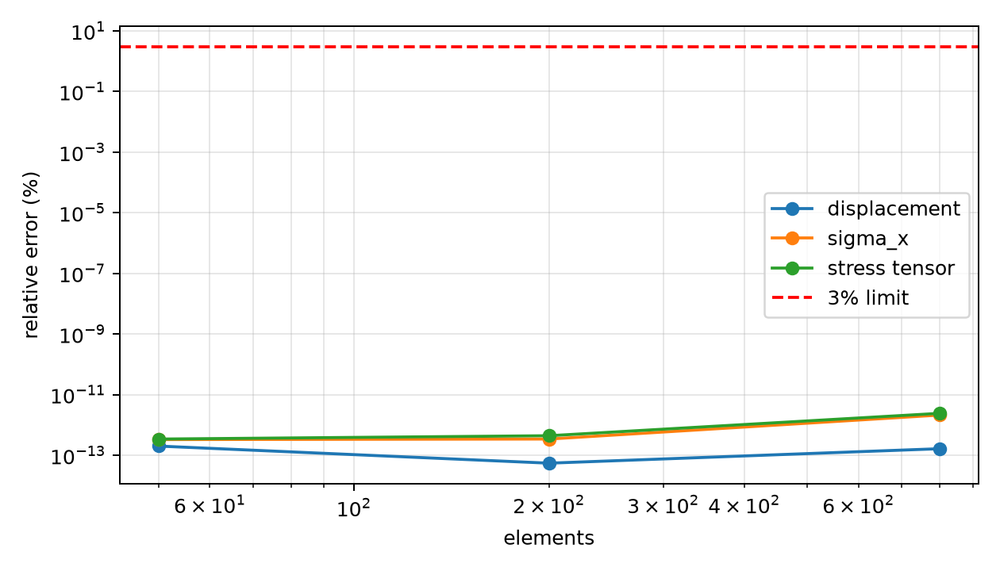

# 等效加筋板均匀轴向膜力：Q4 patch test 研究报告

三组网格的位移与全域单元中心应力均通过独立解析比较。该模型只折算等效厚度，未建立显式加筋几何；不作为加筋板屈曲、后屈曲或极限强度达标证据。

## 1. 问题与计算条件

板长 L=2 m、宽 H=1 m，板厚 10 mm，加筋折算厚度 6 mm，总厚度 t=16 mm。E=210 GPa、ν=0.3，右端均匀轴向力 P=1 MN，规则 Q4 平面应力双精度模型。左端全部 ux 固定，只固定一个 uy 以消除平移，并允许泊松收缩。

## 2. 参考解与误差定义

```text
A = H t = 0.016 m²
sigma_x = P/A = 62.5 MPa; sigma_y = tau_xy = 0
ux(x) = P x/(EA)
uy(y) = -ν P (y+H/2)/(EA)
ux(L) = 0.595238095238 mm
```

所有单元中心均参与应力比较。sigma_x 和 von Mises 用全场相对 L2 误差；应力张量误差包括 sigma_y、tau_xy 对零参考的偏离，分母采用非零轴向应力场范数。三组网格在机器精度附近的误差变化不用于计算虚假的收敛阶。

## 3. 计算过程

生成 10×5、20×10、40×20 网格，将边载荷按梯形权重积分，求解节点位移、恢复三分量应力，检查总载荷等于 1 MN。验证器从完整原始场重新计算位移和应力误差，不使用存储的 qualified 标记决定通过。

## 4. 真实计算结果与相对误差

| 网格 | 端均值 ux mm | 位移误差 | 位移场 L2 | sigma_x L2 | 应力张量 L2 | sigma_x 范围 MPa | 反力 N | 相对力不平衡 |
|---|---:|---:|---:|---:|---:|---:|---:|---:|---:|
| 10×5 | 0.595238095238 | 2.00361e-13% | 4.59898e-13% | 3.28378e-13% | 3.41177e-13% | 62.5000000000–62.5000000000 | -999999.999999997 | 2.794e-15 |
| 20×10 | 0.595238095238 | 5.46438e-14% | 9.3381e-13% | 3.41808e-13% | 4.39653e-13% | 62.5000000000–62.5000000000 | -999999.999999999 | 8.149e-16 |
| 40×20 | 0.595238095238 | 1.63931e-13% | 9.61751e-12% | 2.1114e-12% | 2.40834e-12% | 62.5000000000–62.5000000000 | -999999.999999997 | 3.143e-15 |

全部应力与位移误差严格小于 3%，载荷相对误差小于 1e-10，反力相对不平衡小于 1e-8。均匀膜力场是 patch test，机器精度结果不能外推为复杂加筋结构的精度。

## 5. 位移、应力和网格验证图




常应力场按真实均值着色，浮点噪声不放大成空间斑块。应力图在模型边缘延伸的是中心值显示插值，数值验收仅使用原始单元值。

## 6. 结论与能力边界

均匀膜力 patch test 的位移、全场应力、载荷和反力已闭环。显式纵骨弯曲、局部屈曲、初始缺陷、残余应力、塑性和极限强度仍需要独立证据。

## 7. 复现与原始证据

```bash
OMP_NUM_THREADS=1 PYTHONPATH=src .venv/bin/python scripts/run_stiffened_panel_fe_benchmark.py --output docs/assets/benchmark-clouds/stiffened-panel/results.json
PYTHONPATH=src .venv/bin/python scripts/build_verified_benchmark_reports.py
```

[完整节点与应力及验收 JSON](../../assets/benchmark-clouds/stiffened-panel/results.json)。同一正文的 Word、PDF、HTML 均在 exports 目录。
