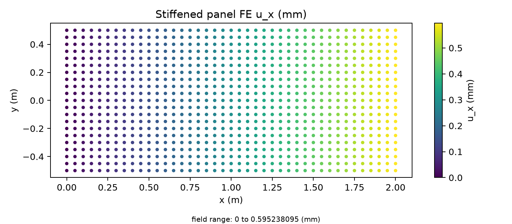
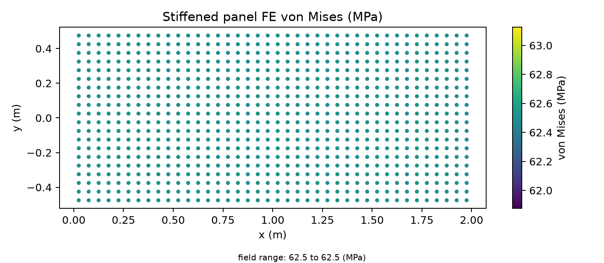

# 船舶等效加筋板轴向膜力：Q4 有限元验证报告

> 结论：三组网格均通过常应变膜片检验。最细 `40×20` 网格的端部平均位移误差为 **`1.293×10⁻¹²%`**，轴向反力相对不平衡为 **`1.828×10⁻¹²%`**；位移和应力云图均由本次真实 FE 字段直接生成。

## 1. Benchmark 问题

该案例把板厚和纵向加筋面积折算为等效厚度，构成一个受均匀轴向膜力的矩形板条。它用于检验 Q4 单元的常应变复现能力、边界条件、边载荷积分、反力和应力恢复，不等同于真实加筋板屈曲或极限强度分析。

均匀膜片参考解为：

```text
t_eff = t_plate + t_stiff = 0.016 m
A = H t_eff = 0.016 m²
σ_x = P/A = 62.5 MPa
u_x(L) = PL/(EA) = 5.952380952×10⁻⁴ m = 0.595238095 mm
ε_y = -ν σ_x/E
```

## 2. 计算条件

| 项目 | 数值或设置 |
|---|---:|
| 长度 `L` | `2.0 m` |
| 宽度 `H` | `1.0 m` |
| 板厚 | `10 mm` |
| 加筋等效厚度 | `6 mm` |
| 有效厚度 `t_eff` | `16 mm` |
| `E, ν` | `210 GPa, 0.30` |
| 右端总轴向力 `P` | `1.0 MN` |
| 单元 | 规则 Q4、平面应力 |
| 网格 | `10×5`、`20×10`、`40×20` |
| 验收 | 端部平均位移相对误差 `<3%`，载荷与反力闭合，字段完整 |

左边界约束全部节点的 `u_x`，并仅固定一个 `u_y` 消除刚体平移，从而允许泊松收缩并与均匀膜片解析解一致。右端均布线载荷按梯形规则积分：`ny` 个边段合计恰为 `1 MN`，两个角点取半权。

## 3. 计算过程

1. 生成三组结构化 Q4 网格。
2. 组装线弹性平面应力方程并施加最小充分约束。
3. 将均布边载荷积分成节点力，显式核对总载荷。
4. 求解位移，恢复 `σ_x、σ_y、τ_xy` 和 von Mises 应力。
5. 汇总左端反力，计算位移误差与力平衡误差。

## 4. 真实计算结果

### 4.1 位移、应力和误差

| 网格 | 节点 / 单元 | FE 端部位移 (mm) | 参考位移 (mm) | 位移相对误差 | `σ_x` 范围 (MPa) | von Mises 范围 (MPa) | 状态 |
|---|---:|---:|---:|---:|---:|---:|---|
| `10×5` | `66 / 50` | `0.595238095238094` | `0.595238095238095` | `2.004×10⁻¹³%` | `62.499999999999–62.500000000000` | `62.499999999999–62.500000000000` | `qualified` |
| `20×10` | `231 / 200` | `0.595238095238100` | `0.595238095238095` | `8.014×10⁻¹³%` | `62.499999999999–62.500000000003` | `62.499999999999–62.500000000003` | `qualified` |
| `40×20` | `861 / 800` | `0.595238095238103` | `0.595238095238095` | **`1.293×10⁻¹²%`** | `62.499999999998–62.500000000005` | `62.499999999998–62.500000000004` | **`qualified`** |

误差处于双精度舍入量级，说明 Q4 对常应变场通过 patch test。此时误差随网格不再单调下降并不代表不收敛，而是数值已达到机器精度，继续用误差比估计收敛阶没有物理意义。

### 4.2 载荷与反力平衡

| 网格 | 施加轴力 (N) | 左端轴向反力 (N) | 绝对不平衡 (N) | 相对不平衡 |
|---|---:|---:|---:|---:|
| `10×5` | `1,000,000.000000` | `-999,999.999999997` | `2.8×10⁻⁹` | `2.8×10⁻¹³%` |
| `20×10` | `1,000,000.000000` | `-1,000,000.000000011` | `1.1×10⁻⁸` | `1.1×10⁻¹²%` |
| `40×20` | `1,000,000.000000` | `-1,000,000.000000018` | `1.83×10⁻⁸` | `1.83×10⁻¹²%` |

最细网格合计竖向反力为 `-2.538×10⁻⁹ N`，相对于轴向载荷可忽略。载荷、约束和反力构成完整平衡闭环。

### 4.3 位移云图

最细网格的 `u_x` 从左边界 `0` 线性增长到右边界 `0.595238095 mm`；`u_y` 范围为 `-0.089285714 mm` 至约 `0`，与泊松收缩方向一致。



### 4.4 应力云图

全场 von Mises 应力为 `62.5 MPa`，仅有约 `6×10⁻⁶ Pa` 的浮点波动。空间均匀性与常应变解析解一致。



## 5. 本次纠错说明

旧版脚本先按端边节点数平均载荷、再把两个端点减半，导致节点力之和小于标称 `1 MN`；同时把左端所有 `u_y` 固定，使边界条件与允许泊松收缩的解析解不一致。旧报告中的 `1.841%` 并非可信的 FE 离散误差。

现版本按边段数进行梯形积分并采用最小充分约束。文中所有表格、反力和云图均已由修正后的脚本重新计算，旧数值不再作为验证证据。

## 6. 能力边界

该案例只证明等效连续体在均匀轴向膜力下的线弹性求解正确。它不验证纵骨局部弯曲、板格屈曲、初始缺陷、焊接残余应力、材料塑性、后屈曲和极限承载力；这些内容需要独立的壳单元与非线性 benchmark。

## 7. 复现与原始证据

```bash
PYTHONPATH=src .venv/bin/python scripts/run_stiffened_panel_fe_benchmark.py \
  --output docs/assets/benchmark-clouds/stiffened-panel/results.json
python scripts/render_stiffened_panel_fe_clouds.py \
  docs/assets/benchmark-clouds/stiffened-panel/results.json \
  --output-dir docs/assets/benchmark-clouds/stiffened-panel
```

正文已直接给出判定所需全部结果；[完整节点位移与单元应力 JSON](../../assets/benchmark-clouds/stiffened-panel/results.json)用于审计和二次后处理。

## 8. 结论

该案例已完成真实 Q4 求解、三网格 patch test、载荷/反力平衡以及位移与应力云图闭环。三组网格的位移误差均远小于 3%，最细网格误差为 **`1.293×10⁻¹²%`**。
