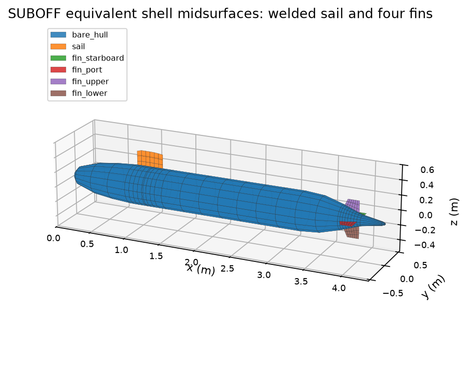
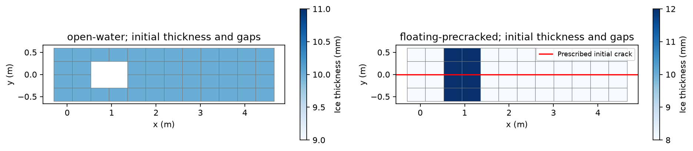
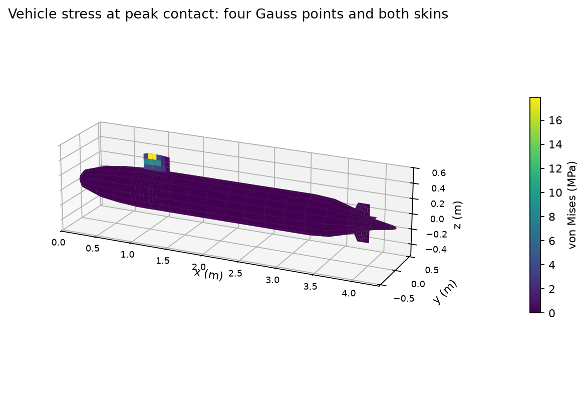
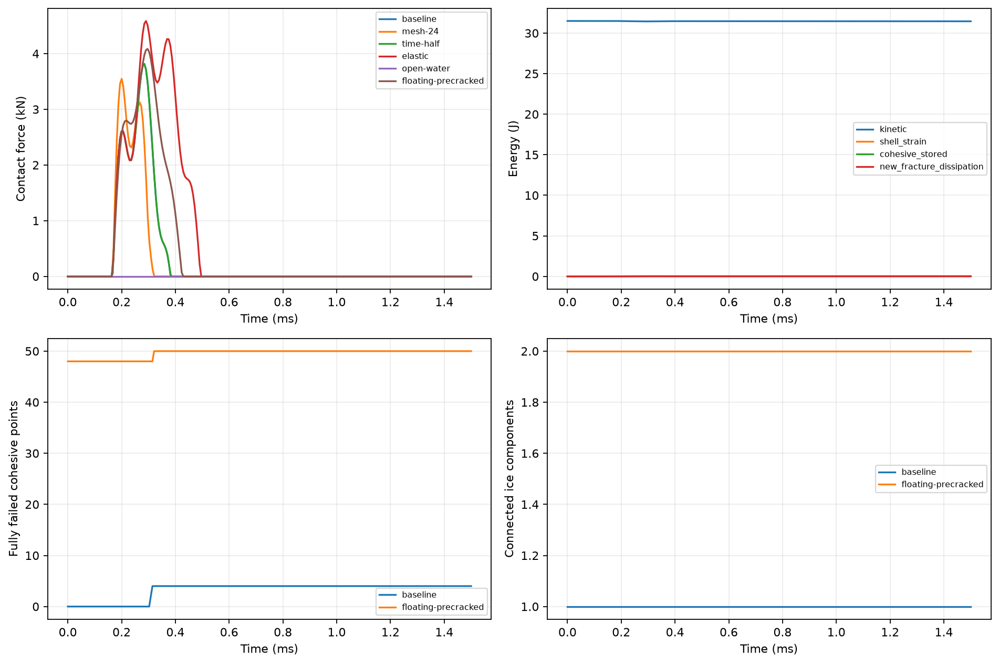

# 带附体 SUBOFF 与可配置冰层：初始上浮撞击

## 状态与适用范围

这是实际执行并保存全场数据的实验功能。六个算例的几何、能量、竖直动量、接触预期、质量保留和小变形检查均通过；物理精度未认证，尚未证明网格和罚接触参数收敛，也不是完整上浮破冰模拟。此前裸艇案例和其未收敛记录保留。

## 几何、结构与参数

数值几何取自本地 TensorLBM 的 SUBOFF CAD，来源提交和源文件 SHA256 见 appended-16.json / appended-24.json。艇长 4.356 m、直径约 0.5083 m；新增围壳和四片十字尾舵，根部共享艇壳全部六个自由度。艇壳为闭合压力壳；附体是人为构建的等效中面薄片，保留 CAD 围壳顶部轮廓和尾舵后掠平面形状，不能视为完整 NACA 厚翼外皮或真实 SUBOFF 内部结构。围壳顶部接触面积按 CAD 宽度积分。

钢壳和附体厚 3 mm，E=210 GPa，ν=0.3，ρ=7850 kg/m³；钢材质量 142.658171 kg，加声明的设备/压载使总质量为 700 kg。上浮速度 0.3 m/s，初始顶部间隙 0.05 mm，积分时长 1.5 ms。无质量缩放，旋转惯性按物理厚度计算。基准冰厚 10 mm，E=5 GPa、ν=0.3、ρ=900 kg/m³，缝抗拉/剪强度 0.5 MPa，断裂能 5 J/m²。它们是自洽的人工研究参数，未标定海冰试验。



## 新增冰模拟功能

- 独立 Q4 冰片和双线性不可逆黏聚缝；受压缝仍提供弹性抗力。
- 每格冰厚可变；厚度为零或 open_water_cells 指定开水区。厚度阶跃缝在同一实际高度积分，保持刚体旋转相容。
- precracked_pairs 指定原始网格相邻编号之间的初始裂缝；初始断裂能单独记录，不冒充新产生的断裂耗散。
- clamped、simply_supported（仅约束竖直位移）、free 三种外围边界；cohesive 或 elastic 两种冰模式。
- 非均匀冰厚按同一水面计算各自吃水与干舷；基于浮动平衡的重力/静水恢复力，浸没高度截断到 [0,h] 并配套连续势能；默认水密度 1025 kg/m³。
- 可声明每面积附加水质量和线性阻力；阻力使用精确指数半步并记录耗散与外部冲量。这不是求解流体运动的 FSI。
- 只有一道缝所有厚度积分点均失效才断开连通性；输出各碎片网格编号、质量、中心、平均速度和动能。断裂不删除质量。



floating-precracked 的冰厚为 8/12 mm，整条中线预裂缝使其初始就有两块冰，附加水质量系数 10 kg/m²、阻力系数 20 kg/(m²·s)。该算例的两块碎片是预设初始状态，不能当作计算中新形成的贯穿裂缝。

## 保存结果

| 算例 | 结构单元 | 峰值接触 kN | 全时程最大钢材 VM MPa | 失效积分点 初→终 | 冰连通块 初→终 | 最大能量相对误差 |
|---|---:|---:|---:|---:|---:|---:|
| baseline | 602 | 3.8206 | 23.2793 | 0→4 | 1→1 | 9.29e-09 |
| mesh-24 | 1200 | 3.5515 | 19.6703 | 0→4 | 1→1 | 1.05e-08 |
| time-half | 602 | 3.8206 | 23.2793 | 0→4 | 1→1 | 2.32e-09 |
| elastic | 602 | 4.5876 | 28.9721 | 0→0 | 1→1 | 8.36e-09 |
| open-water | 602 | 0.0000 | 0.0000 | 0→0 | 1→1 | 6.93e-14 |
| floating-precracked | 602 | 4.0877 | 26.4414 | 48→50 | 2→2 | 7.56e-09 |

基准峰值力 3.8206 kN，接触发生在围壳顶部。艇壳和尾舵有非零应力，说明附体真实参与传力。开水区对照无接触，弹性冰对照无断裂耗散。所有算例原始结果均有 SHA256 来源记录，独立重组验证器核对最终应力、能量、动量、损伤、质量和碎片。





## 收敛检查与边界

时间步减半后峰值力变化 0.000493%，最大应力变化 0.000063%。结构网格加密后峰值力变化 7.0435%，最大应力变化 15.5030%。对照门槛为 3%；只有两级结构网格，且接触节点采样随加密变化，仍不足以认证网格收敛。罚接触独立敏感性和外部试验/独立求解器对照尚未完成。

当前采用小应变、固定水平位置的竖直接触注册，没有冰压碎、应变率效应、一般碎片再接触/自接触和有限转动破冰。基准冰最终仍连成一块，不能宣称艇体已穿透冰层。若延长时间或改变参数，应检查结果中的 blocked 状态，不能忽略小变形门限。

## 重现与文件

```bash
OMP_NUM_THREADS=1 MKL_NUM_THREADS=1 PYTHONPATH=src .venv/bin/python examples/suboff_appended_ice_simulation.py --config docs/assets/suboff-ice-v2/configs/baseline.json
OMP_NUM_THREADS=1 MKL_NUM_THREADS=1 PYTHONPATH=src .venv/bin/python scripts/validate_suboff_ice_simulation.py
OMP_NUM_THREADS=1 MKL_NUM_THREADS=1 PYTHONPATH=src .venv/bin/python scripts/build_suboff_appended_ice_report.py
```

configs/ 下保存全部参数；appended-16.json / appended-24.json 保存结构几何。结果 JSON 包含所有最终自由度、速度、应力、损伤、时程及五帧位移；impact.pvd 和 frame-*.vtk 可在 ParaView 打开，位移比例为 1。PNG 几何图显示等效中面，未放大位移。

[HTML](exports/suboff_appended_ice_simulation.html) · [PDF](exports/suboff_appended_ice_simulation.pdf) · [Word](exports/suboff_appended_ice_simulation.docx)
