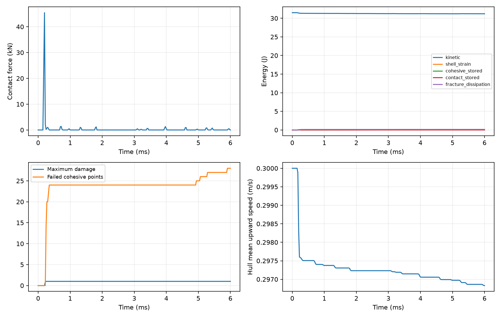
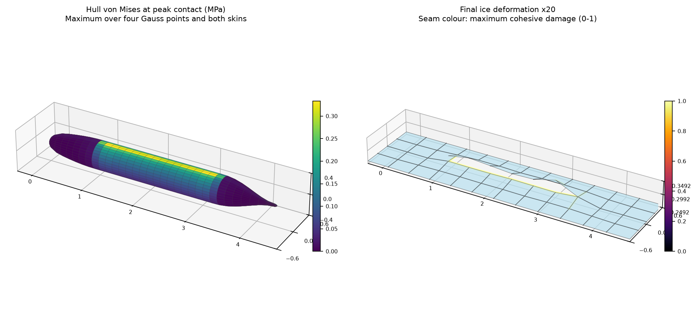
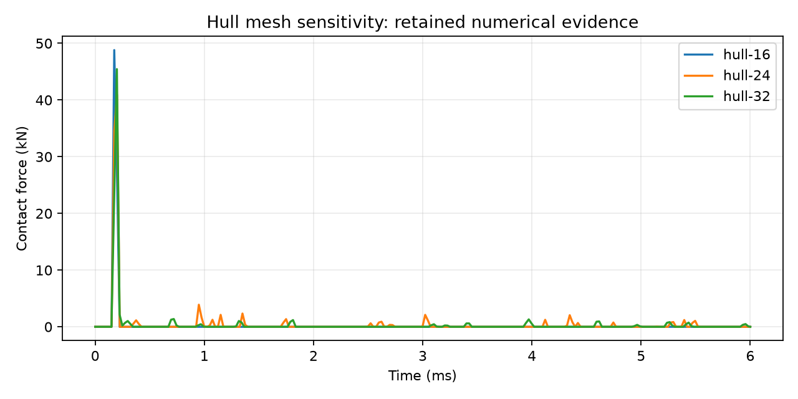

# SUBOFF 人工壳体向上撞冰：初始冲击与黏聚裂损研究案例

## 状态与用途

这是可复现的模型尺度初始上浮撞冰案例。几何来自 TensorLBM，钢壳、设备/压载、冰材料和接缝均为人为定义。当前物理精度未认证；没有破冰实验或独立软件参考解。完整出水、真实海冰承载力和极限冰厚不能由本报告确定。

六组计算的数值敏感性全指标 3% 门槛：**未通过，仍需优化**。失败比较保留在下表中。

## 参数与质量自洽

| 项目 | 数值 |
|---|---|
| 艇长 / 最大直径 | 4.356 m / 0.508285 m |
| 钢壳厚度 / E / ν / 密度 | 3 mm / 210 GPa / 0.3 / 7850 kg/m³ |
| 总质量 / 初始速度 | 700 kg / 0.3 m/s，自由初始速度 |
| 钢壳 / 设备和压载质量 | 139.624763 kg / 560.375237 kg |
| 冰板尺寸 / 厚度 | 4.956 × 1.2 m / 10 mm |
| 冰 E / ν / 密度 | 5 GPa / 0.3 / 900 kg/m³ |
| 接缝峰值强度 / 断裂能 | 0.5 MPa / 5 J/m²，人为设定 |
| 初始艇—冰间隙 / 时长 | 0.05 mm / 6 ms |
| 边界 / 外力 | 冰板外周固支；艇体自由；无外部驱动力 |
| 初始能量 / 动量 | 31.500000 J / 210.000000 kg·m/s |

最细裸艇体外表面封闭体积 0.693702 m³，对应假设水密度 1025 kg/m³ 时约 711.045 kg 排水质量；700 kg 总质量处于相近量级。设备和压载按壳节点面积分布，附着在壳体上。计算保留物理壳厚转动惯量，没有为放大时间步进行质量缩放。这组参数定义一个假想模型，不对应真实潜艇或特定海冰试验。

## 几何和离散方法

复用 TensorLBM `src/tensorlbm/suboff_cad.py` 的 `suboff_radius_profile`，原始源码 SHA256：`1b886d6abeb8019813a12bab1183526dd978fd91ac73fecbb3aaf481026d1638`；来源提交：`8c890b4d0a1619c24d69f1f16fb2ea005f4023d5`。只导出数值节点和连接关系，TensorFEM 求解无需安装 TensorLBM。艇首、艇尾采用方形映射到圆盘的全四边形封帽，所有节点均核对原几何半径函数。

外几何为 CAD 表面；沿面积加权法向向内偏移半个钢壳厚度得到壳参考面，接触使用外几何高度及壳平移。闭合性、边方向、正面积、连通性及 Euler 特征数 2 均检查。32 级网格为 1154 个艇体节点、1152 个壳单元。

采用投影 Q4 膜—Mindlin 壳及稀疏刚度。冰板每片有独立节点；相邻片通过两个端点、两个厚度 Gauss 点的黏聚接缝相连，裂损后节点能够分离。没有删单元、删质量或依据绘图生成裂纹。初始等效开口刚度为 `cohesive_factor × E_ice / min(dx,dy)`。接缝使用相同强度的拉伸/剪切等效开口，受压部分保持弹性；该假设不包含海冰的压碎、应变率或各向异性。

艇节点与冰片通过竖向无摩擦罚接触耦合，形函数将反力分配给四个冰节点，作用力与反作用力严格相反。罚刚度为 `contact_factor × E_ice / h_ice × 节点面积`。接触对象始终为可变形冰片。水平接触归属固定，因此适用范围是短时、主要竖向的冲击。

## 时间积分、断裂能和验收

使用速度 Verlet 积分；初始上浮速度随后由质量、壳刚度、接触和裂损共同决定。时间步取无损壳、全部接缝、全部接触刚度的质量归一化绝对行和上界；还包含黏聚软化斜率界。最细网格名义步长 2.668683e-07 s，共 22483 步。

不可逆最大开口控制卸载刚度。失效开口 `δf = 2 Gc / σc`；接缝耗散由双线性包络积分减去可恢复能量计算。每一步检查总动能、壳应变能、黏聚储能、接触储能及断裂耗散之和。竖向动量与冰板固支边界反力的梯形积分核对。

应力由位移和转角恢复，每步检查所有壳单元四个平面 Gauss 点的上、下表面平面应力。表中 von Mises 不包含横向剪切。355 MPa 只是声明的弹性适用性参考，未接入钢壳塑性。





右图形变放大 20 倍，损伤色标 0–1；VTK 使用真实尺度。接缝局部达到损伤 1 与整条接缝完全断开分别计数。名义最细网格完全断开的接缝 5 条，冰片连通分量 1 个。该短时结果表示裂损起始和发展，尚未证明艇体穿透冰层并完成出水。

## 六组计算

| 计算 | 峰值接触力 kN | 全时程钢壳 Gauss 最大 VM MPa | 断裂耗散 J | 最大能量收支误差 | 完全断开接缝 |
|---|---|---|---|---|---|
| hull-16 | 74.437036 | 13.999969 | 0.144025 | 6.19221e-05% | 6 |
| hull-24 | 60.908241 | 9.642224 | 0.139908 | 3.92362e-05% | 4 |
| hull-32 | 50.885626 | 7.795922 | 0.142616 | 2.68562e-05% | 5 |
| time-half | 50.887734 | 7.796292 | 0.142616 | 5.25649e-06% | 5 |
| contact-double | 71.060143 | 10.477195 | 0.147879 | 5.33284e-05% | 4 |
| ice-fine | 36.522293 | 6.971130 | 0.115061 | 2.66642e-05% | 1 |

艇壳网格 16/24/32；名义冰板网格 12×4；时间步减半、接触罚刚度加倍、冰板 24×8 单独复核。冰板加密同时改变预设裂纹路径网格，不能解释为仅改变单元数的连续体收敛试验。

| 比较 | 峰值接触力变化 | 断裂耗散变化 | 冰挠度变化 | 钢壳 VM 变化 | 全部 <3% |
|---|---|---|---|---|---|
| hull-16 → hull-24 | 18.17482% | 2.85918% | 24.50991% | 31.12682% | 未通过 |
| hull-24 → hull-32 | 16.45527% | 1.93583% | 2.47187% | 19.14809% | 未通过 |
| hull-32 → time-half | 0.00414% | 0.00017% | 0.00025% | 0.00475% | 通过 |
| hull-32 → contact-double | 39.64679% | 3.69046% | 0.01419% | 34.39328% | 未通过 |
| hull-32 → ice-fine | 28.22670% | 19.32121% | 29.98098% | 10.57979% | 未通过 |



节点罚接触、壳面离散和预设裂纹网络的网格敏感性均参与结果。能量守恒证明了当前离散模型的收支一致性，不能替代碰撞力与断裂预测的物理精度验证。

## 可复现命令与原始字段

```bash
OMP_NUM_THREADS=1 MKL_NUM_THREADS=1 PYTHONPATH=src .venv/bin/python examples/suboff_upward_ice_collision.py
OMP_NUM_THREADS=1 MKL_NUM_THREADS=1 PYTHONPATH=src .venv/bin/python scripts/run_suboff_ice_study.py
OMP_NUM_THREADS=1 MKL_NUM_THREADS=1 PYTHONPATH=src .venv/bin/python scripts/validate_suboff_ice_evidence.py
PYTHONPATH=src .venv/bin/python scripts/build_suboff_ice_report.py
```

通过 `--config` 读取 SI 单位参数 JSON，也可用 `--speed`、`--duration`、`--time-safety`。变更参数会重新检查稳定步长和适用性。

- [研究矩阵与敏感性 JSON](../../assets/suboff-ice/study.json)
- [默认参数 JSON](../../assets/suboff-ice/default-config.json)
- [最细网格原始字段](../../assets/suboff-ice/hull-32.json)
- [闭合外几何与溯源](../../assets/suboff-ice/geometry-32.json)
- [裂损连通性 JSON](../../assets/suboff-ice/fracture-topology.json)
- [ParaView 时间序列](../../assets/suboff-ice/impact.pvd)

下一阶段需要控制接触几何的网格敏感性，并明确海水附加质量、浮力/推进与冰板支撑。真实破冰预测还需要海冰材料标定、独立参考计算、大变形接触、压碎和碎冰再接触。
